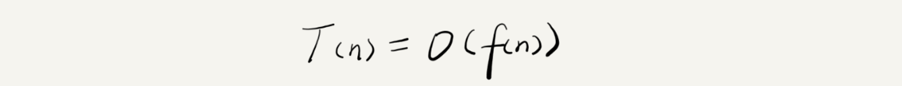
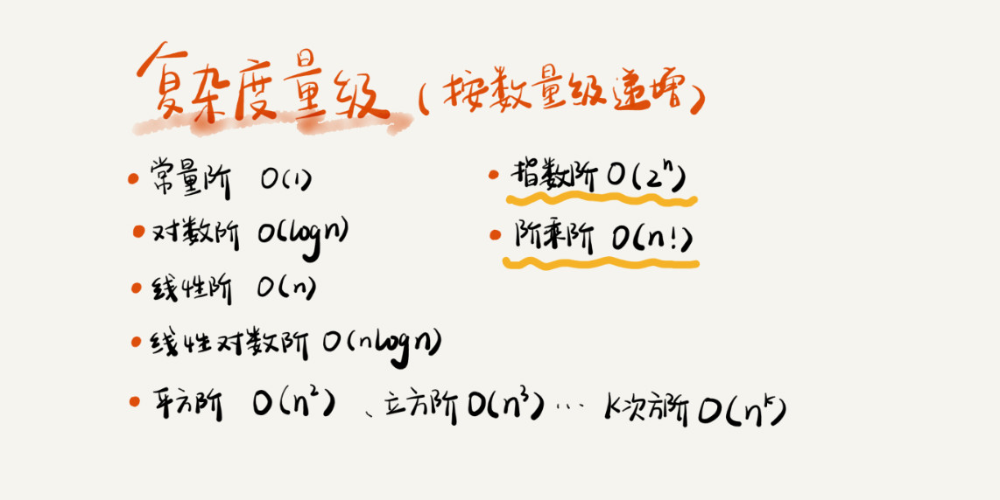
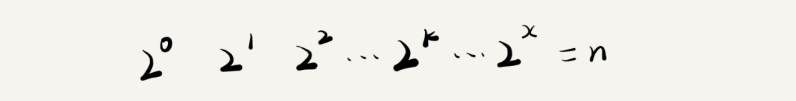

# 复杂度分析
#朴素的开始了/算法/复杂度分析#

## 大O复杂度表示法
假设每行代码的运行时间为`unit_time`
```
int call（int n）{
	int sum = 0;
	int i = 1;
	int j = 1;
	for (; i <= n; ++i) {
		j = 1;
		for (; j <= n; ++j) {
			sum = sum + i * j;
		}
	}
}
```

第2、3、4行代码，每行都需要1个`unit_time`时间，第5、6行代码循环执行了`n`遍，需要`2n * unit_time`的执行时间，第7、8行代码循环执行了`n2`遍，所以整段代码的执行时间`T(n) = (2n2+2n+3) *。unit_time`，所以我们发现代码的执行时间`T（n）`与每行代码的执行次数`n`成正比

我们可以把这个规律总结成一个公式。注意，大O登场了！


解释下这个公式。其实，`T（n）`表示代码执行的时间；`n`表示数据规模的大小；`f（n）`表示每行代码执行的次数总和。

### 大O时间复杂度表示代码执行时间随数据规模增长的变化趋势，所以也叫做渐进时间复杂度，简称时间复杂度

## 时间复杂度分析
1. 只关注循环执行次数最多的一段代码
2. 加法法则：总复杂度等于量级最大的那段代码的复杂度
3. 乘法法则：嵌套代码的复杂度等于嵌套代码内外代码复杂度的乘积

## 几种常见的时间复杂度实例分析



1. O(1)，只要代码的执行时间不随`n`的增大而增大，这样代码的时间复杂度我们都记作O(1)

2. O(logn)、O(nlogn)
```
i = 1;
while(i <= n) {
	i = i * 2;
}
```
从代码中可以看出，变量`i`的值从1开始取，每循环一次就乘以2。当大于`n`时，循环结束。实际上，变量`i`的取值就是一个等比数列。如果我们一个一个把它列出来，就应该是这个样子：


那么这段代码的时间复杂度为O(log3n)

实际上，不管是以2为底、以3为底，还是以10为底，我们都可以把所有对数阶的时间复杂度都记为O(logn)

3. O(m+n)、O(m*n)
```
int call(int m, int n) {
	int sum_1 = 0;
	int i = 1;
	for(; i < m; ++i) {
		sum_1 = sum_1 + i;
	}

	int sum_2 = 0;
	int j = 1;
	for(; j < n; ++j) {
		sum_2 = sum_2 + j;
	}

	return sum_1 + sum_2;
}
```

从代码中可以看出，m和n是表示两个数据规模。我们无法事先评估m和n谁的量级大，所以我们在表示复杂度的时候，就不能简单的利用加法法则，省略其中一个。所以，上面的代码时间复杂度就是O(m+n)

## 最好、最坏、平均、均摊情况时间复杂度