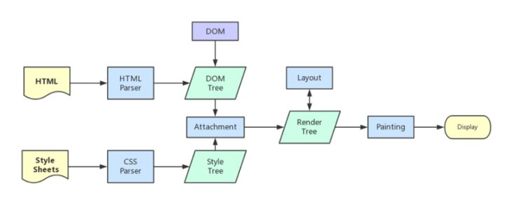

# 从浏览器多进程道JS单线程，JS运行机制整理

## 区分进程和线程
	* 进程是cpu资源分配的最小单位（是能拥有资源和独立运行的最小单位）
	* 线程是cpu调度的最小单位（线程是建立在进程的基础上的一次程序运行单位，一个进程中可以有多个线程）
### Tips
	* 不同进程之间可以通信，不过代价较大
	* 现在，一般通用的叫法：单线程与多线程，都是指在一个进程内的单和多（所以核心还是得属于一个进程才行）

## 浏览器是多进程的
每打开一个Tab页，就相当于创建了一个独立的浏览器进程，但是有时候有些进程会被合并（所以一个Tab页对应一个进程不一定是绝对的）

### 浏览器都包含哪些进程
	1. Browser进程（浏览器的主进程，只有一个）
	2. 第三方插件进程
	3. GPU进程
	4. 浏览器渲染进程（浏览器内核）（Render进程，内部是多线程的）：主要作用为页面渲染，脚本执行，事件处理等

### 浏览器多进程的优势
	1. 避免单个page crash影响整个浏览器
	2. 避免第三方插件crash影响整个浏览器
	3. 多进程充分利用多核优势
	4. 方便使用沙盒模型隔离插件等进程，提高浏览器稳定性

## 重点是浏览器内核（渲染进程）
1. GUI渲染线程
	* 负责渲染浏览器界面，解析HTML，CSS，构建DOM树和RenderObject树，布局和绘制等
	* 当界面需要重绘（Repaint）或由于某种操作引发（Reflow）时，该线程就会执行
	* 注意，GUI渲染线程与JS引擎线程是互斥的，当JS引擎执行时GUI线程会被挂起，GUI更新会被保存在一个队列中等到JS引擎空闲时立即被执行
2. JS引擎线程
	* 也称为JS内核，负责处理Javascript脚本程序（例如V8引擎）
	* JS引擎线程负责解析Javascript脚本，运行代码
	* JS引擎一直等待着任务队列中任务的到来，然后加以处理，一个Tab页（renderer进程）中无论什么时候都只有一个JS线程在运行JS程序
	* 同样注意，GUI渲染线程与JS引擎线程是互斥的，所以如果JS执行的时间过长，这样就会造成页面的渲染不连贯，导致页面渲染加载阻塞 
3. 事件触发线程
	* 归属于浏览器而不是JS引擎，用来控制事件循环（可以理解，JS引擎自己都忙不过来，需要浏览器另开线程协助）
	* 当JS引擎执行代码块如setTimeout时（也可来自浏览器内核的其它线程，如鼠标点击、AJAX异步请求等），会将对应任务添加到事件线程中
	* 当对应的事件符合触发条件被触发时，该线程会把事件添加到待处理队列的队尾，等待JS引擎的处理
	* 注意，由于JS的单线程关系，所以这些待处理队列中的事件都得排队等待JS引擎处理（当JS引擎空闲时才会去执行）
4. 定时触发器线程
	* 传说中 setInterval 与 setTimeout 所在线程
	* 浏览器定时计数器并不是由JS引擎计数的，因为JS引擎是单线程的，如果处于阻塞线程状态就会影响计时的准确
	* 因此通过单独线程来计时并触发定时（计时完毕后，添加到事件队列中，等待JS引擎空闲后执行）
	* 注意，W3C在HTMl标准中规定，规定要求setTimeout中低于4ms的时间间隔算为4ms
5. 异步http请求线程 
	* 在XMLHttpRequest在连接后是通过浏览器新开一个线程请求
	* 将检测到状态变更时，如果设置有回调函数，异步线程就产生状态变更事件，将这个回调再放入事件队列中。再由JS引擎执行
	* Browser进程和浏览器内核（Render进程）的通信过程

## 浏览器内核中线程之间的关系
	* GUI渲染线程与JS引擎线程相互排斥
	由于javascript是可操作DOM的，如果在修改这些元素同时渲染界面（即JS线程和UI线程同时运行），那么渲染线程前后获得的元素数据就可能不一致了
	* JS执行过长阻塞页面加载
	* WebWorker是JS的多线程。
	创建Worker时，JS引擎向浏览器申请开一个子线程（不能操作DOM），JS引擎与worker之间通过特定的方式通信
	* SharedWorker是所有页面共享的

## 简单梳理下浏览器渲染流程

### load事件与DOMContentLoaded事件的先后
当DOMContentLoaded事件触发时，仅当DOM加载完成，不包括样式表、图片。而onload事件触发时，页面上所有的DOM、样式表、脚本、图片都已经加载完成了，所以顺序是 DOMContentLoaded -> onload

### css加载是否会阻塞你dom树渲染
css加载不会阻塞dom树解析，但是会阻塞render树渲染。如果css加载不阻塞render树渲染的话，那么当css加载完之后，render树可能又得重新重绘或者回流了。

### 普通图层和复合图层
[CSS3硬件加速也有坑 - WEB前端 - 伯乐在线](http://web.jobbole.com/83575/)

## 从Event Loop谈JS的运行机制

### setTimeout与setInterval区别
因为每次setTimeout计时后就会去执行，然后执行一段时间后才会继续setTimeout，中间就多了误差（具体与代码执行时间有关）
而setInterval则是每次都精确的隔一段时间推入一个事件（但是，事件的实际执行时间不一定就准确，还有可能是这个事件还没执行完毕，下一个事件就来了），累计效应

所以，目前一般认为的最佳方案是：用setTimeout模拟setInterval，或者特殊场合直接使用requestAnimationFrame

