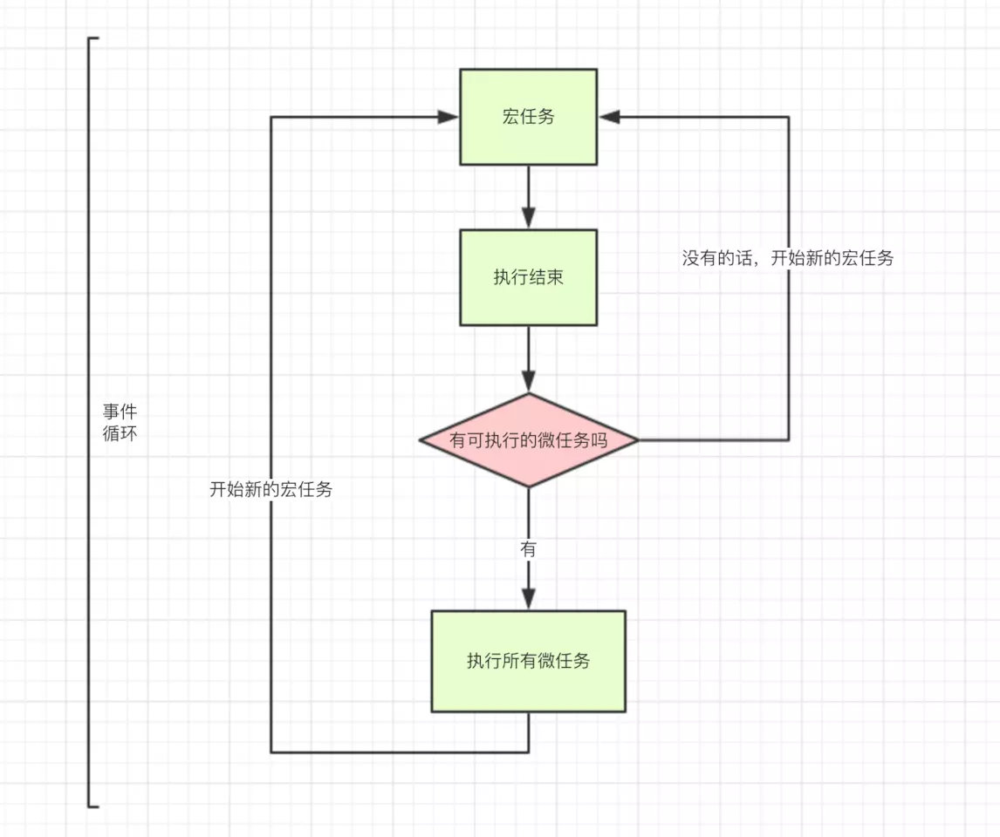

# 事件循环机制event loop

### 理解event loop的最直接的意义就是可以理清setTimeout setImmediate setInterval Promise.nextTick之间的执行顺序

## javascript是一门单线程的语言
⚠️浏览器的event loop是在HTML5中定义的规范，而node中则由libuv库是实现，二者是有区别的，会导致执行结果不一致

1. event loop是一个执行模型，在不同的地方有不同的实现。（浏览器和nodejs基于不同的技术实现了event loop）
2. 任务定义
    * macrotask宏任务（task）：包括整体代码script，setTimeout，setInterval
	* microtask微任务（jobs）：Promise，process.nextTick等
	* 每轮事件循环，都只执行一个宏任务就立即执行所有的微任务



### 总结下运行机制
* 执行一个宏任务（栈中没有就从事件队列中获取）
* 执行过程中如果遇到微任务，就将它添加到微任务的任务队列中
* 宏任务执行完毕后，立即执行当前微任务队列中的所有微任务
* 当前宏任务执行完毕，开始检查渲染，然后GUI线程接管渲染
* 渲染完毕后，JS线程继续接管，开始下一个宏任务

```
console.log('1');

setTimeout(function() {
    console.log('2');
    process.nextTick(function() {
        console.log('3');
    })
    new Promise(function(resolve) {
        console.log('4');
        resolve();
    }).then(function() {
        console.log('5')
    })
})
process.nextTick(function() {
    console.log('6');
})
new Promise(function(resolve) {
    console.log('7');
    resolve();
}).then(function() {
    console.log('8')
})

setTimeout(function() {
    console.log('9');
    process.nextTick(function() {
        console.log('10');
    })
    new Promise(function(resolve) {
        console.log('11');
        resolve();
    }).then(function() {
        console.log('12')
    })
})

//output
1 7 
6 8
2 4 3 5
9 11 10 12
```