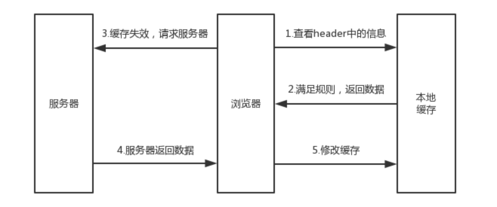

# 缓存机制

## 强缓存
浏览器在加载资源时，会先根据本地缓存资源的`header`中的信息判断是否命中强缓存，如果命中则直接使用缓存中的资源不会再想服务器请求



强缓存的一般流程：
1. 查看`header`头中的`Expire`和`Cache-control`来判断是否满足规则
2. 如果满足规则，就返回缓存的数据
3. 如果不满足规则，就向服务器发送请求
4. 服务器返回数据
5. 将新数据存入缓存

### Expire
这个字段包含了一个时间，过了这个时间，响应就会失效。也就是说`Expire`这个字段表示缓存到期时间，我们来打开一个网站并查看`Response Header`看看这个字段：
```
Expires：Sat, 02 Nov 2019 12:04:46 GMT
```
`GMT`表示的是格林威治时间，和北京时间相差8小时，所以上面的时间表示的是北京时间`2019年11月2日20:04:46`

#### 缺陷
这是个绝对时间，也就是说，如果我修改了客户端的本地时间，是不是就会导致判断缓存失效了呢

### Cache-Control
既然不能设置绝对时间，那我就设置个相对时间呗

在`HTTP/1.1`中，增加了一个字段`Cache-Control`，它包含了一个`max-age`属性，该字段表示资源缓存的最大有效时间，这是一个相对时间
```
Cache-Control：max-age=600
```
这个表示的是最大有效时间`600s`，注意，单位是秒

#### `Cache-Control`属性
* no-cache：需要进行协商缓存，发送请求到服务器确认是否使用缓存
* no-store：禁止使用缓存，每一次都要重新请求数据
* public：默认设置
* private：不能被多用户共享
现在基本上都会同时设置`Expire`和`Cache-Control`，`Cache-Control`的优先级别更高

## 协商缓存
当强缓存没有命中的时候，浏览器会发送一个请求到服务器，服务器根据请求头中的部分信息来判断是否命中缓存。如果命中，则返回`304`，告诉浏览器资源未更新，可使用本地缓存


协商缓存的一般流程：
1. 把资源标识，比如`If-Modify-Since`或`Etag`发送到服务器，确认资源是否更新
2. 如果资源未更新，请求响应返回的`http`状态为`304`并且会显示一个`Not Modified`的字符串，告诉浏览器使用本地缓存
3. 如果资源已经更新，返回新的数据
4. 将新数据存入缓存

### Last-Modified，If-Modified-Since
浏览器第一次请求资源的时候，服务器返回的`header`上会带有一个`Last-Modified`字段，表示资源最后修改时间
```
Last-Modified: Fri, 27 Oct 2017 07:55:30 GMT
```
当浏览器再次请求服务器时，请求头中会带有一个`If-Modified-Since`字段，这个值是第一次请求返回的`Last-Modified`的值，服务器在收到这个请求后，将`If-Modified-Since`和当前的`Last-Modified`进行对比，如果相等，返回`304`

#### 缺陷
* 最小单位是秒，也就是说如果我短时间内资源发生了变化，`Last-Modified`并不会发生变化
* 周期性变化，如果这个资源在一个周期修改回原来的样子，我们认为是可以使用缓存的，但是`Last-Modified`可不这样认为

### Etag
`Etag`一般是由文件的`hash`生成的，也就是说它可以保证资源的唯一性，资源发生改变就会导致`Etag`发生变化
同样地，在浏览器第一次请求资源时，服务器会返回一个`Etag`标识。当再次请求该资源的时候，会通过`If-no-match`字段将`Etag`发送给服务器，然后服务器进行比较，如果相等，则返回`304`

#### 注意
`Last-Modified`和`Etag`是可以同时设置的，服务器会优先校验`Etag`，如果`Etag`相等就会继续比对`Last-Modified`，最后才决定是否返回`304`