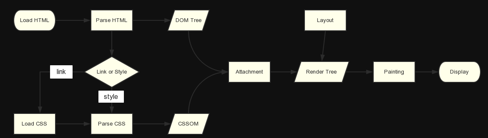
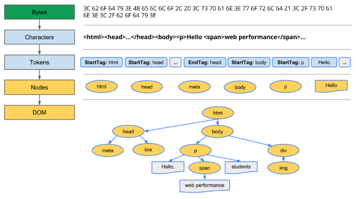
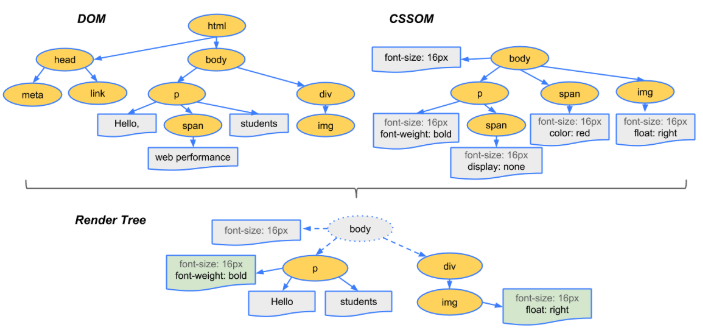

# 渲染原理
[从浏览器渲染原理谈页面优化 - CSDN博客](https://blog.csdn.net/riddle1981/article/details/78681191)
[浏览器的工作原理：现代网络浏览器幕后揭秘 - HTML5 Rocks](https://www.html5rocks.com/zh/tutorials/internals/howbrowserswork/#HTML_Parser)
#朴素的开始了/浏览器/浏览器的渲染机制/渲染原理#

## 关键路径
1. 处理`HTML`标记并构建`DOM`树
2. 处理`CSS`标记并构建`CSSOM`树
3. 将`DOM`与`CSSOM`合并成一个渲染树
4. 根据渲染树来布局，计算每个节点的几何信息，再将各个节点绘制到屏幕上

## 构建`DOM`树

1. 转换：浏览器从磁盘或网络读取`HTML`的原始字节，并根据文件的指定编码（例如 UTF-8）将它们转换成各个字符
2. 令牌化：浏览器将字符串转换成`W3C HTML5`标准规定的各种令牌，例如，“”、以及其它尖括号的字符串。每个令牌都具有特殊含义和一组规则
3. 词法分析：发出的令牌转换成定义其属性和规则的对象
4. `DOM`构建：最后，由于`HTML`标记定义不同标记之间的关系，创建的对象链接在一个树数据结构内

## CSSOM
与处理`HTML`时一样，我们需要将收到的`CSS`规则转换成某种浏览器能够理解和处理的东西

### 为什么`CSSOM`具有树结构
这是因为浏览器为页面上的任何对象计算最后一组样式时，都会先从适用于该节点的最通用规则开始（例如，如果该节点是`body`元素的子项，则应用所有`body`样式），然后通过应用更具体的规则（即规则`向下级联`）以递归方式优化计算的样式

## 合并渲染树

⚠️渲染树只包含渲染网页所需的节点，如`display：none`的元素是不会出现在渲染树中的

## 布局及绘制
布局：我们计算了哪些节点应该是可见的以及它们的计算样式，但我们尚未计算它们在设备视口内确切位置和大小
绘制（栅格化）：将渲染树中的每个节点转换成屏幕上的实际像素形成我们可见的页面

## 页面渲染的完整流程
1. 当浏览器拿到HTML文档时首先先会进行HTML文档解析，构建DOM树

2. 遇到css样式如link标签或者style标签时开始解析css，构建样式树。HTML解析构建和CSS的解析是相互独立的，并不会造成冲突，因此我们通常将css样式放在head中，让浏览器尽早解析css

3. 当html的解析遇到script资源会怎么样？答案是停止DOM树的解析开始下载js。因为js是会阻塞html解析的，是阻塞资源。其原因在于js可能会改变html现有结构。例如有的节点是用js动态构建的，在这种情况下就会停止dom树的构建开始下载解析js。脚本在文档的何处插入，就在何处执行。当HTML解析器遇到一个script标记时，它会暂停构建DOM，将控制权移交给JS引擎，等JS引擎运行完毕，浏览器会从中断的地方恢复DOM构建。而因此就会推迟页面首绘的时间。可以在首绘不需要js的情况下用async和defer实现异步加载。这样js就不会阻塞html的解析了。当HTML解析完成后，浏览器会将文档标注为交互状态，并开始解析那些处于deferred模式的脚本，也就是那些应在文档解析完成后才执行的脚本。然后，文档状态将设置为“完成”，一个“加载”事件将随之触发。
⚠️异步执行是指下载，执行js时仍会阻塞

4. 在得到dom树和css样式树后就可以进行渲染树的构建了。应注意的是渲染树和dom元素是相对应的，但并非一一对应。比如非可视化的dom元素不会插入呈现树中，例如head元素。如果元素的display属性值为“none”，那么也不会显示在呈现树中（但是visibility属性值为hidden的元素仍会显示）

5. 渲染树构建完毕后将会进行布局。布局使用流模型的layout算法。所谓流模型，即是指layout的过程只需进行一遍即可完成，后出现在流中的元素不会影响前出现在流中的元素，layout过程只需从左至右从上至下一遍完成即可。但实际实现中，流模型也有例外。layout是一个递归的过程，每个节点都负责自己及其子节点的layout。
此时renderTree已经构建完毕，不过浏览器渲染树引擎并不直接使用渲染树进行绘制，为了方便处理定位（裁剪），溢出滚动（页内滚动），CSS转换／不透明／动画／滤镜，蒙版或反射，Z排序等，浏览器需要生成另外一棵树-层树。因为绘制过程如下：
  * 获取DOM并将其分割为多个层
  * 将每个层栅格化，并独立的绘制进位图中
  * 将这些位图作为纹理上传至GPU
  * 复合多个层来生成最终的屏幕图像