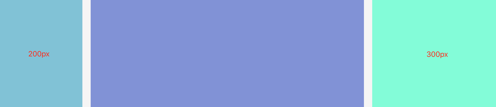

# float

## float
Float属性指定一个元素应沿其容器的左侧或右侧放置，允许文本和内联元素环绕它。原本设计是为了实现文字环绕图片的效果（报纸上常见的效果）

## 改变Display计算值
由于`float`意味着使用块布局，某些情况下它会修改`display`值的计算值。如`inline`、`inline-block`都会成为`block`。所以如果行内级元素设置`float`，是不需要再去设置`display`的。

## 如何定位
当一个元素浮动之后，它会被移出正常的文档流，然后向左或向右平移，一直碰到所处的容器块的边缘，或者碰到另外一个浮动的元素。如果有个行盒，则对齐于行盒的顶部


从上面的demo中，我们可以看到：
* 如果浮动元素的上一个兄弟元素是块级元素，浮动元素直接在新的一行进行左右平移
* 如果浮动元素的上一个兄弟元素是行内级元素，那么就在当前行盒进行左右平移，且外顶部对齐当前行盒的顶部
* 如果浮动元素比较多的话，会一个接一个，直到填满容器一整行，之后换行至下一行

## 清除浮动
会导致的两个问题
* 对后面的元素布局产生影响
* 父元素的高度坍塌
我们知道，在计算页面排版的时候，如果没有设置父元素的高度，那么该元素的高度是由他的子元素高度撑开的。但是如果子元素设置了浮动，脱离了文档流，那么父元素计算高度的时候就会忽略该子元素，甚至当所有子元素都是浮动的时候，就会出现父元素高度为0的情况，这就是所谓的高度坍塌

### 清除前面兄弟元素浮动
只需要在不想受到浮动元素影响的元素上使用clear：both
```
<div class="f1">我是左浮动元素</div>
<div class="fr">我是右浮动元素</div>
<div class="cb">我不受浮动元素的影响</div>
```

```
.f1{ float: left; }
.fr{ float: right; }
.cb{ clear: both; }
```
在CSS2以前，clear的原理为自动增加元素的上外边距（margin-top）值，使之最后落在浮动元素的下面。在CSS2.1中引入了清楚区域（clearance），在元素上外边距之上增加的额外间距，使之最后落在浮动元素的下面。所以如果要设置浮动元素与clear元素的间距，得设置浮动的元素的margin-bottom，而不是clear元素的margin-top

### 闭合子元素浮动
* 给最后一个子元素clear：both
* 给父元素新建一个BFC

## 负margin布局



```
<div class="main">
	<div class="main-inner"></div>
</div>
<!-- 边栏将会使用负margin回到该显示的位置 -->
<div class="aside-left"></div>
<div class="aside-right"></div>
```

```
.main, .aside-left, .aside-right{
	float:left;
}
.main{
	width: 100%;
}
.main-inner{
	margin-left: 220px;
	margin-right: 320px;
}
.aside-left{
	width: 200px;
	margin-left: -100%;
}
.aside-right{
	width: 300px;
	margin-left: -300px;
}
```

样式的核心思想是，main为浮动的100%宽度，然后左边边栏的空间通过main-inner的左右margin来空出来，最后给浮动的左右栏设置负的margin回到视觉效果的位置上

### 为什么负margin能够把掉下去的内容拉起来呢
简单来说，这是因为它的换行是因为内容挤不下，所以掉下去了，跟行内元素有点相似，而不像是块级元素那样，是硬性的换行。

