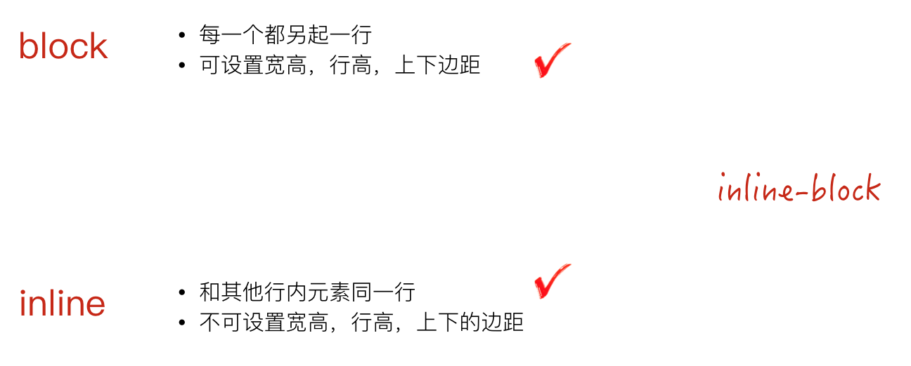

# 深入了解inline-block

## 什么是`inline-block`
我们知道，`block`元素每个都会新起一行，而`inline`又元素不能设置宽高，那么有没有办法可以实现一个元素既可以设置宽高，又可以在行内显示的呢，这就是`inline-block`元素



来看一个简单的例子，如下：
```
<div class="list">
	<div class="item"></div>
	<div class="item"></div>
	<div class="item"></div>
</div>
```

```
.list .item{
	display: inline-block;
	width: 100px;
	height: 100px;
	background: #ccc;
}
```

效果如下：


## 为什么会有水平间隙问题
我们从上图中看到`item`之间有间隙，但是我们在代码中并没有设置margin水平间距，那么这个间隙是怎么产生的呢？

这是因为我们在编写代码的时候输出空格、换行都会产生空白符。而浏览器是不会忽略空白符的，且对于多个连续的空白符浏览器会自动合并成一个，故产生了所谓的间隙。

## 如何清除空白符
1. 代码不换行，但是会导致代码的可读性及维护性丢失
2. 设置父元素`font-size`，然后重置子元素的`font-size`，空白符也是字符

## 垂直间隙问题
设置inline-block时候，`vertical-align`需要设置为`middle`

