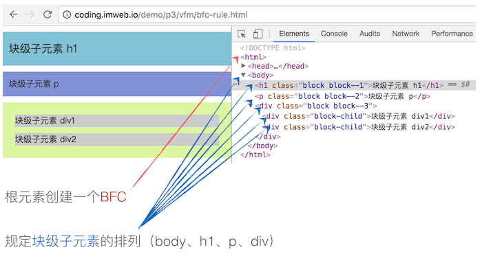

# 格式化上下文

## Formatting Context（格式化上下文）
> 指页面中一个渲染区域，并且拥有一套渲染规则，它决定了其子元素如何定位，以及与其他元素的相互关系和作用。
就如使用不同的容器来装水一样，呈现出来的形态也将不一样。

最基本的两个格式化上下文分别为：块格式化上下文（BFC）和行内格式化上下文（IFC）

## BFC（块格式化上下文）
> 块格式化上下文（Block Formatting Context，BFC）它是一个独立的渲染区域，只有Block-level box参与， 它规定了内部的Block-level Box如何布局，并且与这个区域外部毫不相干。

## 什么条件可以创建BFC：
* 根元素或包含根元素的元素
* 浮动元素（元素的`float`不是`none`）
* 绝对定位元素（元素的`position`为`absolute`或`fixed`）
* 行内块元素（元素的`display`为`inline-block`）
* 表格单元格
* 表格标题
* 匿名表格单元格元素
* `overflow`值不为`visible`的块元素
* `display`值为`flow-root`的元素
* `contain`值为`layout`、`content`或`strict`的元素
* flex item 和 grid item
* 多列容器
* `column-span`为all的元素

BFC规定的是其块级子元素的排列方式，而不是创建BFC的元素本身。如下图：

## BFC布局规则
* 块级盒会在垂直方向，一个接一个地放置，每个盒子水平占满整个容器空间
* 块级盒垂直方向的距离由margin决定。属于同一个BFC的两个相邻块级盒的margin会发生重叠
* 每个元素的margin box的左边， 与包含块border box的左边相接触(对于从左往右的格式化，否则相反)。即使存在浮动也是如此。
* BFC的区域不会与float box重叠。
* BFC就是页面上的一个隔离的独立容器，容器里面的子元素不会影响到外面的元素。反之也如此。
* 计算BFC的高度时，浮动元素也参与计算

## 相关BFC应用场景
1. 自适应两栏布局
2. 清除内部浮动
3. 防止垂直margin折叠

## IFC
当块容器盒不包含任何块级盒时，就会创建一个行内格式化上下文。

IFC规定的是行内级子元素的排列方式，其渲染规则比较多，这里把几个重要点简单罗列如下：
* 盒子一个接一个的在水平方向摆放，当容器宽度不够时会换行
* 每一行将生成一个匿名行盒，包括该行的所有行内级盒
* 水平方向上，当所有盒的总宽度小于匿名行盒的宽度时，那么水平方向排版由`text-align`属性来决定
* 垂直方向上，行内级盒的对齐方式由`vertical-align`控制，默认对齐为baseline
* 行盒的高度由内部子元素中实际高度最高的盒子计算出来，值得注意的是，行内盒的垂直的border，padding与margin都不会撑开行盒的高度

### 注意
在IFC的环境中，是不能存在块级元素的，如果将块级元素插入到IFC中，那么此IFC将会被破坏掉变成BFC，而块级元素前的元素或文本和块级元素后的元素或文本将会各自自动产生一个匿名块盒将其包围

