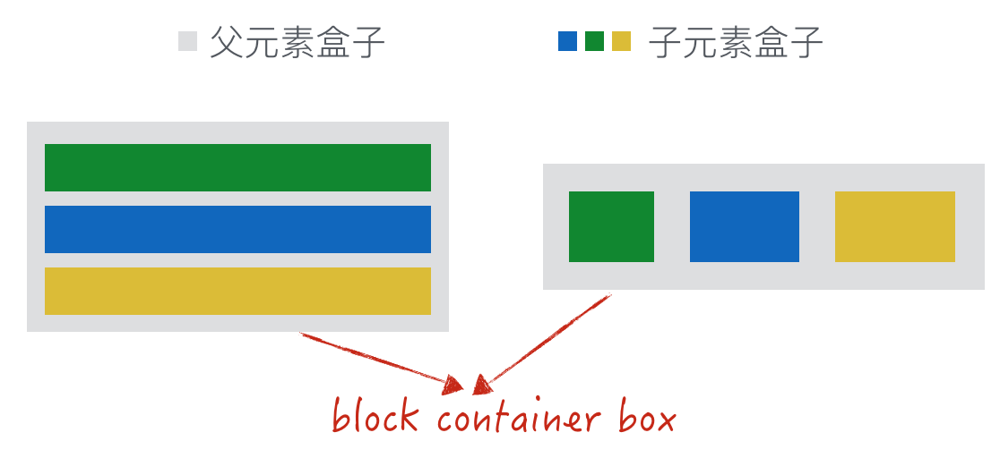
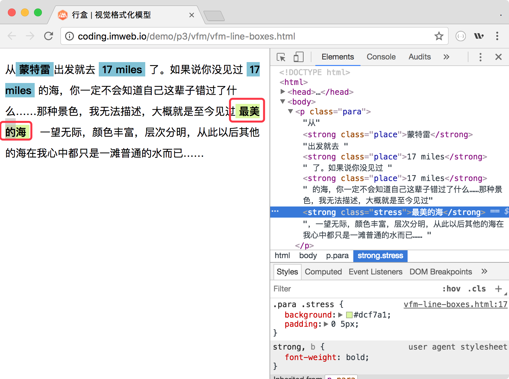
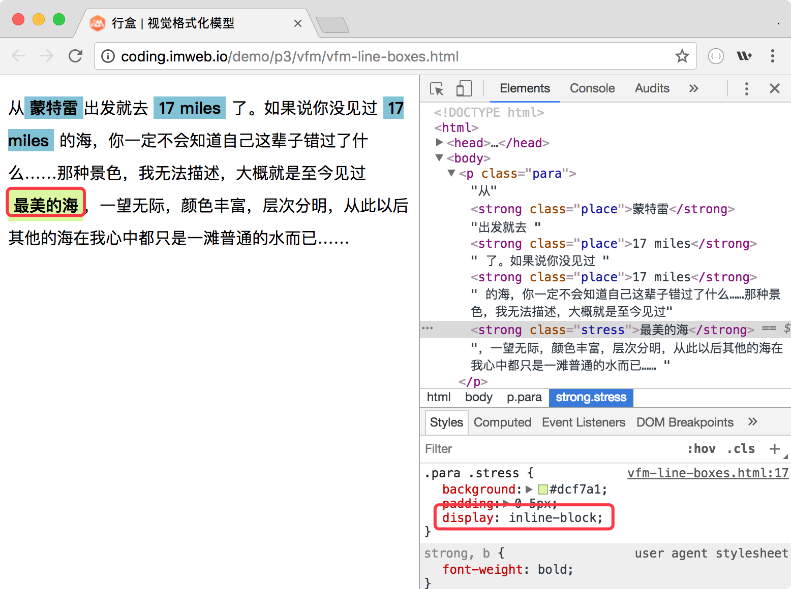
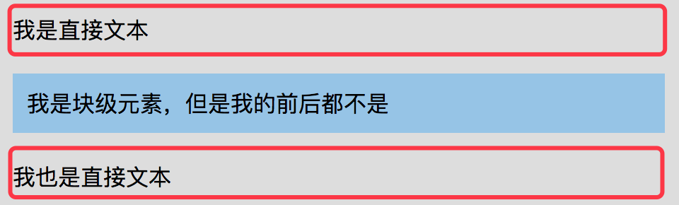

# 盒子模型

## box-sizing
### 表现
* `content-box`是默认值（标准盒子模型）。如果你设置一个元素的宽为100px，那么这个元素的内容会有100px宽，并且任何边框和内边距的宽度都会增加到最后绘制出来的元素宽度中。
* `border-box`告诉浏览器去理解你设置的边框和内边距的值是包含在width内的。也就是说，如果你将一个元素的width设为100px，那么这100px会包含其它的border和padding，内容区的实际宽度会是width减去border + padding的计算值。

### 值
* content-box
* border-box
* padding-box

## 盒类型
盒的不同类型关键取决于CSS的属性`display`值，如`block`值的盒跟`inline`值的盒就是不一样的类型

### 块级盒与行内级盒
* `display`为`block`、`list-item`、`table`、`flex`、`grid`时，它就是块级元素，块级元素会生成块级盒
* 同样当`display`为`inline`、`inline-block`、`inline-table`、`inline-flex`、`inline-grid`时，它就是行内级元素，行内级元素生成行内级级盒

### 块容器盒
所谓块容器盒，就是该元素的直接子元素只能是块级盒，或只能是行内级盒


### 块盒与行内盒
* 块盒由`display`值为`block`的元素生成，属于块级盒中的其中一种
* 行内盒由`display`值为`inline`的非替换元素生成，属于行内级盒中的一种。
* 除了行内盒之外，其余的行内级盒都是原子行内级盒，它的典型特征就是作为一个整体，不能拆分换行

这里的“最美的海”就是行内级盒


如果将“最美的海”的`display`值设置为`inline-block`，它就成为原子行内级盒



### 匿名盒
有时候为了需要会添加补充性盒，这些盒称为匿名盒，它们没有名字，不能被CSS选择器选中。所以匿名盒不能为其设置样式，所有样式均来自继承或初始值

* 匿名块盒
我们有个div元素，里面有两个直接文本及一个p元素
```
<div class="block">
	我是直接文本
  <p class="block-p">我是块级元素，但是我的前后都不是</p>
  我也是直接文本
</div>
```


* 匿名行内盒
```
<p><span>什么：</span>直接文本</p>
```

### 行盒
注意行盒与行内盒是不一样的。简单来说，行盒是由行内格式化上下文产生的盒，用于表示一行。如下图，整个文本显示为5行，而每行都会有一个看不见的行盒在发挥作用


