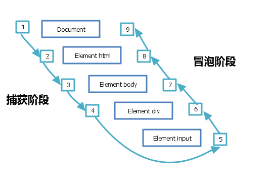

# DOM事件流



1. 事件冒泡
	* 事件开始时由最具体的元素接受，然后逐级向上传播到较为不具体的节点
2. 事件捕获
	* 事件捕获的思想是不太具体的DOM节点应该更早接收到事件，而最具体的节点应该最后接收到事件。与事件冒泡的顺序相反。
3. DOM事件流
	* DOM事件流包括三个阶段：
	**事件捕获阶段、处于目标阶段、事件冒泡阶段**
4.  target.addEventListener ( type,  listener ,  useCapture  ) 设置事件的捕获或冒泡，true：捕获，false：冒泡，默认为false。
```
<div id="wrap">
	<div id="clickme">CLICK ME</div>
</div>

//example 1
document.getElementById('wrap').addEventListener('click', foo1, false);
document.getElementById('clickme').addEventListener('click', foo2, false);

function foo1(event) { console.log(111); }
function foo2(event) { console.log(222); }
// 222 111

//example 2
document.getElementById('wrap').addEventListener('click', foo1, true);
document.getElementById('clickme').addEventListener('click', foo2, true);
// 111 222

//example 3
document.getElementById('wrap').addEventListener('click', foo1, false);
document.getElementById('clickme').addEventListener('click', foo2, true);
// 222 111
```