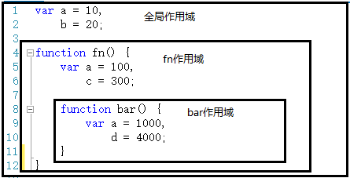

# 作用域

## 静态作用域（又称词法作用域）与动态作用域
* 因为Javascript采用的是词法作用域，函数的作用域在函数定义时就决定了。而与词法作用域相对的是动态作用域，函数的作用域是在函数调用时才决定的
```
//example1
var value = 1;
function foo() {
	console.log(value);
}

function bar() {
	var value = 2;
	foo();
}

bar(); // 1

//example2
var scope = "global scope";
function checkscope(){
    var scope = "local scope";
    function f(){
        return scope;
    }
    return f();
}
checkscope();

//example3
var scope = "global scope";
function checkscope(){
    var scope = "local scope";
    function f(){
        return scope;
    }
    return f;
}
checkscope()();
```

## Javascript的作用域
* 全局作用域
* 函数作用域
* 块级作用域（ES6提出，let和const都会创建块级作用域）
* 作用域是一个很抽象的概念，类似于一个“地盘”


* ⭐️作用域在函数定义时就确定了，而不是在函数调用时⭐️
* 作用域只是一个“地盘”，一个抽象的概念，其中没有变量。要通过作用域对应的执行上下文来获取变量的值
* 作用域有上下级的关系，上下级关系的确定就看函数是在哪个作用域下创建的
* ⭐️作用域最大的用处就是隔离变量，不同作用域下同名变量不会有冲突
* 作用域中变量的值是在执行过程中产生的，而作用域是在函数创建时就确定了
* ⚠️**如果要查找一个作用域下某个变量的值，就需要找到这个作用域对应的执行上下文，再在其中寻找变量的值**

```
//example 1
var a = 1
function fn1(){
  function fn2(){
    console.log(a)
  }
  var a = 2
  return fn2
}
var fn = fn1()
fn() //输出多少

var a = 1
function fn1(){
  var a = 2
  return fn2
}
function fn2(){
  console.log(a)
}
var fn = fn1()
fn() //输出多少
```

* ⚠️**函数在执行的过程中，先从自己内部找变量。如果找不到，再从创建当前函数所在的作用域去找, 以此往上**

* es6 函数的扩展
	* 参数的默认值，会形成一个单独的作用域
```
let x = 1;
function f(y = x) {
	let x = 2;
	console.log(y);
}
f(); // 1

let foo = 'outer';
function bar(func = () => foo) {
  let foo = 'inner';
  console.log(func());
}
bar(); // outer

上面代码中，函数f调用时，参数y = x形成一个单独的作用域。这个作用域里面，变量x本身没有定义，所以指向外层的全局变量x。函数调用时，函数体内部的局部变量x影响不到默认值变量x
```