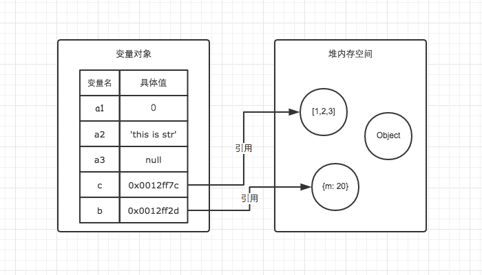

# 内置类型

# 👊不可变的原始值 和 可变的对象引用
## 7种内置类型（6种基本类型，1种引用类型）
* string
* number
* boolean
* null
* undefined
* symbol（es6新增）
* object（引用类型）

## 存储顺序
* 原始数据类型直接存放在栈（stack）中，占据空间小、大小固定，属于频繁，使用数据，所以放在栈中存储
* 引用数据类型存储在堆（heap）中的对象，占据空间大、大小不固定。如果存储在栈中，将会影响程序运行的性能
* 引用数据类型在栈中存储了指针，该指针指向堆中该实体的起始地址。当解释器寻找引用值时，会首先检索其中在栈中的地址，取得地址后从堆中获得实体


## typeof
* typeof对于基本类型，除了null都可以显示正确的类型
```
typeof 1 // number
typeof '1' // string
typeof undefined // undefined
typeof true // boolean
typeof Symbol() // symbol
typeof b // 未声明，但是还是会显示undefined
```
* typeof对于对象来说，除了函数都会显示object
```
typeof [] // object
typeof {} // object
typeof function() {} // function
```
* typeof对于null来说，虽然说它是基本类型，但是会显示object，这是一个存在了很久的bug。因为在JS的最初版本中，使用的是32位系统，为了性能考虑，使用低位存储了变量的类型信息，000开头代表是对象，然后null表示为全零，所以将它错误的判断为object。虽然现在的内部类型判断代码已经改变了，但是对于这个bug却是一直流传了下来
* 为了获得一个变量的正确类型，可以通过 ~Object.prototype.toString.call~，这样就可以获得类似[Object Type]的字符串

## 类型转换
* 加法运算，其中一方是字符串类型，就会把另一个也转为字符串类型
* 除加法运算之外的运算，只要其中一方是数字，那么另一方就转为数字


## Examples
```
//example 1
var a = 'jirengu'
var b = 'jirengu'
console.log( a === b )  //?

var obj1 = {}
var obj2 = {}
console.log( obj1 === obj2 ) //?

//example 2
var count = 1
var obj1 = {count: 10}

incNumber(count)
console.log( count )  // ?

incObject( obj1 )
console.log( obj1.count )

var obj2 = {count}  等价于 <=> var obj2 = {count: count}
incObject( obj2 )
console.log( count )

function incNumber(count){
  return ++count
}
function incObject(obj){
  obj.count++
}

//output
true
false
1
11
1
```