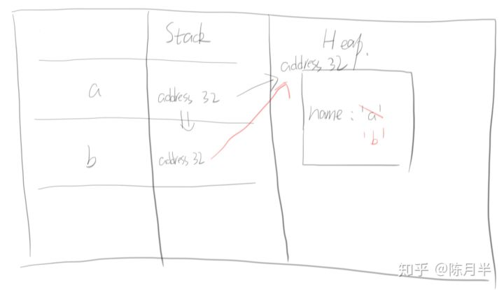

# 深浅拷贝

## 先看几个小问题
```
var a = 1
var b = a
b = 2
//问题1：请问a显示几

var a = {name: 'a'}
var b = a;
b = {name: 'b'}
//问题2

var a = {name: 'a'}
var b = a
b.name = 'b'
//问题3

var a = {name: 'a'}
var b = a
b = null
//问题4
```

### 为了理解以上代码运行时发生了什么，需要简单讲一下`JS`引擎管理内存的原理
1. `JS`引擎将内存分为代码区和数据区
2. 数据区分为`Stack`（栈内存）和`Heap`（堆内存）
3. 简单类型的数据直接存在`Stack`里
4. 复杂类型的数据是把`Heap`的地址存在`Stack`里

### 分析问题3为例：



```
// 声明变量a，a的值是对象，属于复杂类型，所以a将一个引用地址存放在Stack，数据放在Heap
var a = {name: 'a'}
// 声明b=a，实际上是将a的引用地址复制过来
var b = a
// 改了b.name，此时 a 和 b同为一个引用地址
b.name = 'b'
```


## 所以这些和`Javascript`深拷贝有什么关系呢
> 对于简单类型的数据来说，赋值就是深拷贝

> 对于复杂类型的数据（对象）来说，才要区分深浅拷贝

## 浅拷贝
只复制一层对象的属性
* slice
* concat
* Object.assign(target, …sources)

## 深拷贝
* JSON.parse(JSON.stringify())
	* 缺陷：对于函数会导致转换之后变为null
* 手写递归实现

## 环
```
var a = { a: 1}
var b = { b: a}
```

## 递归实现深拷贝
```
//第一版
const shallowCopy = object => {
  // 只拷贝对象
  if (typeof object !== 'object') {
    return object;
  }

  // 判断是否数组
  const newObject = object instanceof Array ? [] : {};

  for (var key in object) {
    if (object.hasOwnProperty(key)) {
      newObject[key] = object[key];
    }
  }

  return newObject;
}

const deepCopy = object => {
  // 只拷贝对象
  if (typeof object !== 'object') {
    return object;
  }

  // 判断是否数组
  const newObject = object instanceof Array ? [] : {};

  for (var key in object) {
    if (object.hasOwnProperty(key)) {
      typeof object[key] === 'object' ? newObject[key] = deepCopy(object[key]) : newObject[key] = object[key];
    }
  }

  return newObject;
}
```

