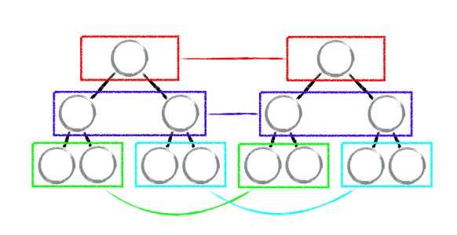
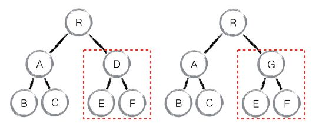
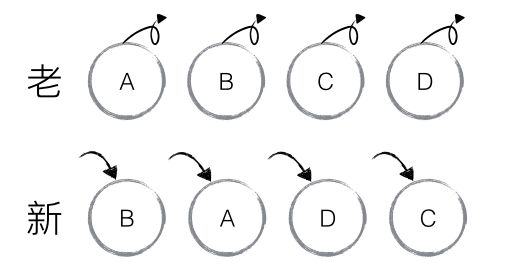
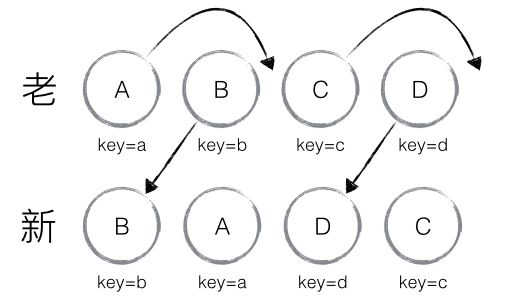

# domDiff

## 如何诠释React
* UI = f(state)

## 传统的diff算法
计算一颗树形结构转换成另一颗树形结构的最小操作，传统的diff算法通过循环递归比对节点，复杂度达到O(n^3)，其中n是树中节点的总数

## React中的O(n)的diff策略
1. Web UI中DOM节点跨层级的移动操作特别少，可以忽略不计
2. 拥有相同类的两个组件将会生成相似的树形结构，拥有不同类的两个组件将会生成不同的树形结构
3. 对于同一层级的一组子节点，它们可以通过唯一id进行区分

基于以上三个前提策略，React分别对tree diff、component diff以及element diff进行算法优化

## tree diff
基于策略一，React对树进行分层比对，两颗树只会对同一层次的节点进行比较。
既然DOM节点跨层级的移动操作少到可以忽略不计，针对这一现象，React通过updateDepth对Virtual DOM树进行层级控制，只会对相同颜色方框内的DOM节点进行比较，即同一个父节点下的所有子节点。当发现节点已经不存在，则该节点以及其子节点会被完全删除掉，不会用于进一步的比较。

## component diff
* 如果是同一类型的组件，按照原策略继续比较virtual DOM tree
* 如果不是，则将该组件判断为dirty component，从而替换整个组件下的所有子节点
* 对于同一类型的组件，有可能其virtual DOM没有任何变化，如果能够确切的知道这点那可以节省大量的diff运算时间，因此React允许用户通过shouldComponentUpdate()来判断该组件是否需要diff

如上图，一旦组件D和组件G不是同类型的组件，就会直接删除D，重新创建G

## element diff
当节点处于同一层级时，React diff提供了三种节点操作，分别为：插入、移动、删除

* 插入，新的component类型不在老集合里，即是全新的节点
* 移动，在老集合有新component类型，且element是可更新的类型，generateComponentChildren已调用receiveComponent，这种情况下，prevChild=nextChild，就需要做移动操作，可以复用以前的DOM节点
* 删除，老component类型，在新集合里也有，但对应的element不同则不能直接复用和更新，需要删除，或者老component不在新集合里的，也需要删除

如上图，导致的结果是删除A、B、C、D，插入B、A、C、D

### 优化策略
允许开发者对同一层级的同组子节点，添加唯一key进行区分

如上图，diff结果是B、D不做任何操作，A、C进行移动

