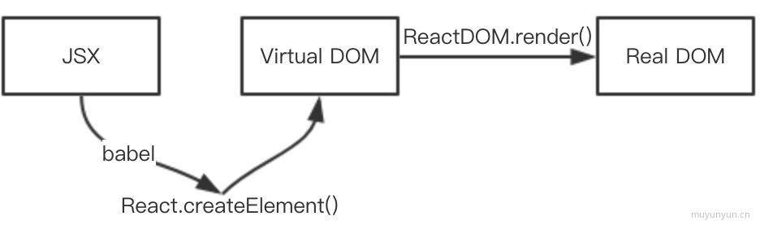

# JSX和虚拟DOM

## 什么是JSX？
JSX是一种语法糖，经过Babel转换成React.createElement（）的形式

## JSX如何转换为虚拟DOM
```
const element = (
	<div className="title">
		hello<span className="content">world!</span>
	</div>
)
```
可以转换为如下形式：
```
var element = React.createElement(
	"div",
	{ className: "title"},
	"hello",
	React.createElement(
		"span",
		{ className: "content" },
		"world!"
	)
);
```

至此，我们可以看到，JSX语法糖经过Babel编译之后转换成了一种对象，该对象就是所谓的::虚拟DOM::

## 为什么要有虚拟DOM
* DOM对象很大很重
* DOM操作会引发restyle、reflow、repaint

## 虚拟DOM转化为真实DOM
在React中，我们知道将虚拟DOM转化为真实DOM是使用 ::React.render:: 实现的，具体如下
```
import ReactDOM from ‘react-dom’
ReactDOM.render（
	element,
	document.getElementById('root')
）
```

## 小结


