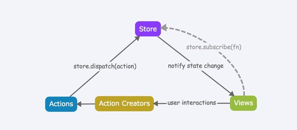

# redux

## 数据流
作为`Flux`的一种实现方式，`Redux`自然保持着数据流的**单向性**，用一张图来形象说明



## `Store`
数据存储中心，同时连接着`Actions`和`Views`(React Component)

### `Store`如何接受来自`Views`的`Action`？
答：每一个`Store`实例都拥有`dispatch`方法，`Views`只需要通过调用该方法，并传入`action`对象作为形参，`Store`自然就可以收到`Action`，就像这样：
```
store.dispatch({ type: 'INCREASE' })
```

### `Store`在接收到`Action`之后，需要根据`Action.type`和`Action.playload`修改存储数据，那么，这部分逻辑写在哪里，且怎么将这部分逻辑传递给`Store`知道呢？
答：数据修改逻辑写在`Reducer`（一个纯函数）里，`Store`实例在创建的时候，就会被传递这样一个`reducer`作为形参，这样`Store`就可以通过`Reducer`的返回值更新内部数据里

### `Store`通过`Reducer`修改好了内部数据之后，又是如何通知`Views`需要获取最新的`Store`数据来更新的呢？
答：每一个`Store`实例都提供了一个`subscribe`方法，`Views`只需要调用该方法注册一个回调（内涵`setState`操作），之后在每次`dispatch（action）`时，该回调都会被触发，从而实现重新渲染；对于最新的`Store`数据，可以通过`Store`实例提供的另一个方法`getState`来获取。
****
总结归纳几点：
1. `Store`的数据修改，本质上是通过`Reducer`来完成的
2. `Store`只提供`get`方法（即`getState`），不提供`set`方法，所以数据的修改一定是通过`dispatch（action）`来完成，即：action -> reducers -> store
3. `Store`除了存储数据之外，还有这消息发布/订阅（pub/sub）的功能，也正是因为这个功能，它才能够同时连接着`Action`和`Views`
	* `dispatch`方法 对应着 pub
	* `subscribe`方法 对应着 sub

## Reducer
`Reducer`，这个名字来源于数组的一个函数`reduce`，它们两比较相似的地方在于：接收一个旧的`prevState`，返回一个新的`nextState`。

在上文讲解`Store`的时候，得知：`Reducer`是一个纯函数，用来修改`Store`数据的，这种方式给我们带来两点好处：
1. 数据拆解
2. 数据不可变（immutability）

### 数据拆解

### 数据不可变
