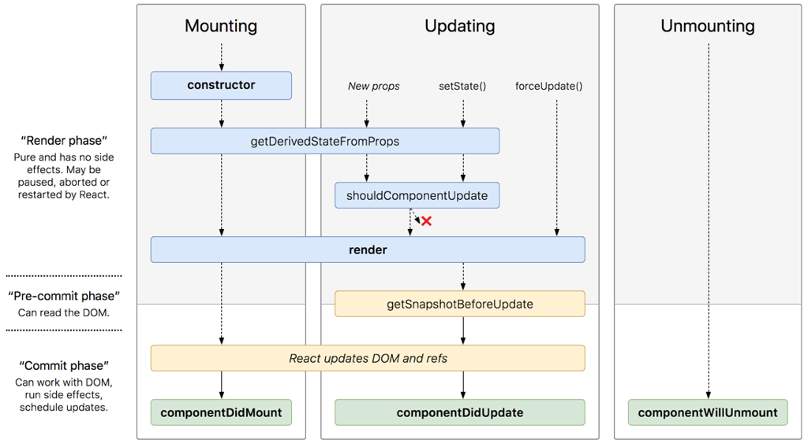

# 生命周期
#朴素的开始了/React/react/生命周期#

## 装载过程
* constructor
* getDerivedStateFromProps
* render
* componentDidMount

## 更新期间
* getDerivedStateFromProps
* componentWillUpdate
* render
* getSnapshotBeforeUpdate
* componentDidUpdate

## 卸载期间
* componentWillUnmount

## 错误捕获
* componentDidCatch