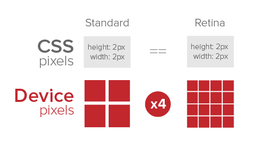

# 移动端适配基本概念

## 有这样一个场景
为什么设计师根据iphone6（375*667）设计出来的设计稿尺寸是750 * 1334？

## 先来明确一些基本概念
### DPI（Dots Per Inch）
是测量空间点密度的单位，它表示每英寸能打印上的墨滴数量

### PPI（Pixels Per Inch）
来表示一英寸屏幕上显示的像素点的数量。

应用实例：27寸Mac显示屏的PPI是109，这表示每英寸上显示了109个像素点。实际屏幕的宽度是23.5英寸，23.5英寸约等于2560，因此原始屏幕分辨率就是2560 * 1440px

### 屏幕分辨率（原始分辨率）
分辨率定义了屏幕上显示的像素数量。

一个27寸的显示屏，原始分辨率是2560 * 1440px，PPI是109。如果减小分辨率，元素将会显示得更大。如果想要设置27寸屏幕分辨率为1280 * 720，GPU会让一个像素点变成原来的2倍大来填充屏幕，那么结果就是会变得模糊。

### 什么是视网膜显示屏
“Retina（视网膜）显示屏”是Apple公司在发布iphone 4时引入的。之所叫做Retina是因为设备的PPI非常高以至于人的视网膜也不能在屏幕上分辨出像素点来

### 什么是像素比
当你的设计需要在不同的PPI下转换时，像素比就是你的救星。当你知道像素比后，就不需要再考虑设备的详细规格了。

以iPhone3G和4为例，相同物理大小上4的像素点是3G的2倍，因此像素比就是2，这表示只需要你的资源乘以2，就可以兼容4的分辨率了

### 物理像素（physical pixel）
一个物理像素是显示器上最小的物理显示单元，在操作系统的调度下，每一个设备像素都有自己的颜色值和亮度值

### 设备独立像素（density-independent pixel）
设备独立像素（也叫密度无关像素），可以认为是计算机坐标系统中得一个点，这个点代表一个可以由程序使用的虚拟像素（比如：CSS像素），然后由相关系统转换为物理像素

### 设备像素比（device pixel ratio）
设备像素比（简称dpr）定义了物理像素和设备独立像素的对应关系，它的值可以按如下的公式得到：

设备像素比 = 物理像素 ／ 设备独立像素

设备像素比（dpr）是指在移动开发中1个CSS像素占用多少设备像素，如2代表1个CSS像素用2X2个设备像素来绘制

## 设计中px、pt、PPI、DPI、dp、sp之间的关系
* px：Pixel，像素，电子屏幕上组成一幅图画或照片的最基本单元
* pt：Point，点，印刷行业常用单位，等于1/72英寸
* PPI：Pixel per inch，每英寸像素数，该值越高，则屏幕越细腻
* DPI：Dot per inch，每英寸多少点，该值越高，则图片越细腻
* dp：Dip，Density-independent pixel，是安卓开发用的长度单位，1dp表示在屏幕像素点密度为160ppi时1px长度
* sp：Scale-independent pixel，安卓开发用的字体大小单位

## viewport视窗
### visual viewport
是页面当前显示在屏幕上的部分。用户可以滚动来改变他所看到的页面的部分，或者通过缩放来改变visual viewport的大小

### layout viewport
就是页面原来的大小

### idea viewport
对设备来说最理想的布局视口尺寸。
* 理想窗口的尺寸是浏览器厂商决定的，同一设备可以有不同的尺寸
* 不同设备的相同浏览器理想窗口也会不同，比如手机和平板，而且会随着设备转向改变
* 虽然有那么多不同尺寸的理想视口，但是平时开发我们只要告诉浏览器使用它的理想视口（也就是width=device-width或者 initial-scale=0）

